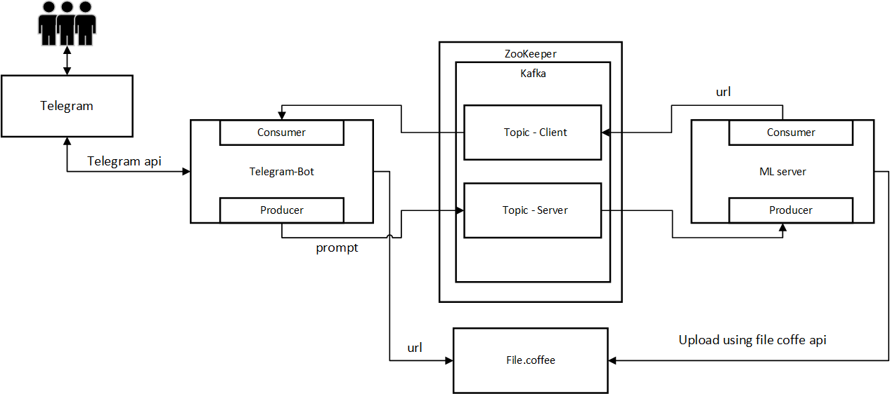

# Генерация изображений
Результат проекта телеграм бот, в котором можно в ответ на запрос подсказки получить изображение сгенерированное Stable Diffusion

Презентация проекта - [Презентация](presentation\presentation.pdf)

## Структура проекта
- [Бот](#bot)
- [Сервер](#server)
- [Обучение](#Learning)

### Телеграм Бот

- [main](/bot/app.py) - Приложение для запуск бота, подлкючается к Kafka и генерирует сообщения


### Сервер

- [server](server/Server.py) - Сервер принимает сообщения через Kafka, генерирует изображение и отправляет ответ также через Kafka

### Обучение

- [train](Learning/Lab_1.ipynb) - Ноутбук с обучением модели

### Архитектура



### Запуск

Запускается используя Docker-compose

```
sudo docker-compose up
```

(возможно придется использовать vpn, блокируются Российские ip адреса)

### Использование

Получившийся бот очень прост в использовании.

На данный момент в нем есть  три команды:
 “start”, “help” и “txt2img”. 

Команда “start” позволяет начать работу, а также проверить работает ли в данный момент бот.

По команде “help” бот предоставит краткое описание и подскажет как воспользоваться его главной  функцией – генерацией изображения с помощью “txt2img”.


Вы можете найти бота в Телеграм по имени - @MAI_OOP_Bot 
https://t.me/MAI_OOP_Bot 
